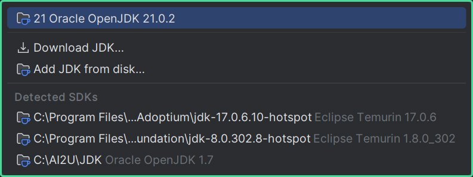

# 📓 AulasDS

## 📰 Descrição

Estudos iniciais de Java desenvolvidos durante o segundo ano do ensino técnico da ETEC

## 💾 Como executar o programa

- Passo 1: Utilize a IDE da sua preferência (por exemplo, a IDE do <a href = "https://www.jetbrains.com/pt-br/idea/"> Intellij, </a> como mostrado no exemplo) 

- Passo 2: Clique em **"Setup JDK"**

- Passo 3: Clique em **"Download JDK"**

- Passo 4: Instale a versão mais recente

- Passo 5: Após a instalação, procure a classe principal ***(Exercícios)*** e execute o programa

## 💻 Tecnologias Utilizadas
`Trabalhado durante as aulas:`

## 🙋 Autores
[    Gabriel Possato ](https://github.com/possatogabriel)
 
 

     
